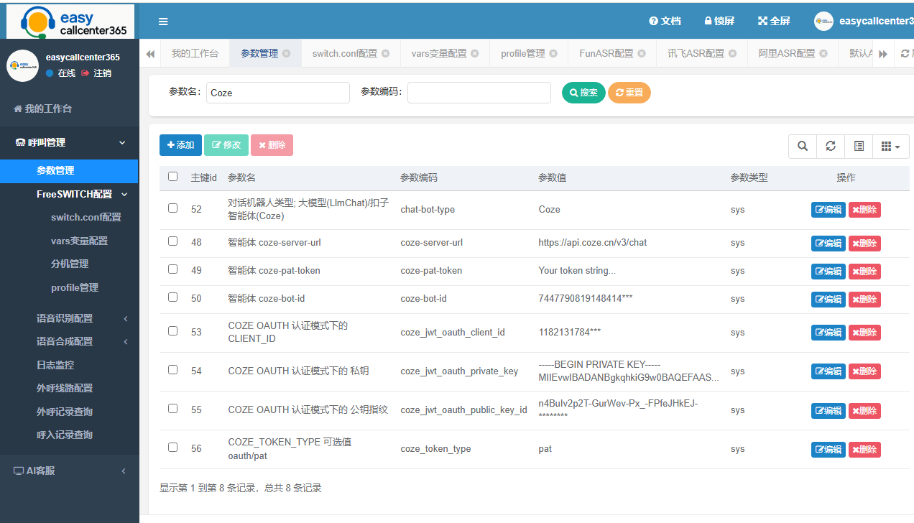
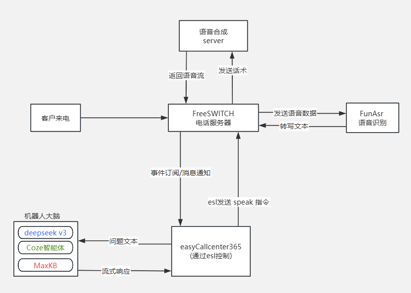
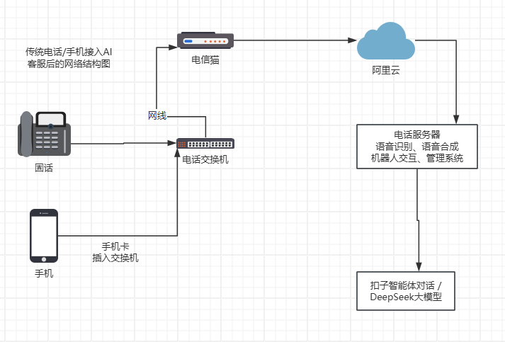
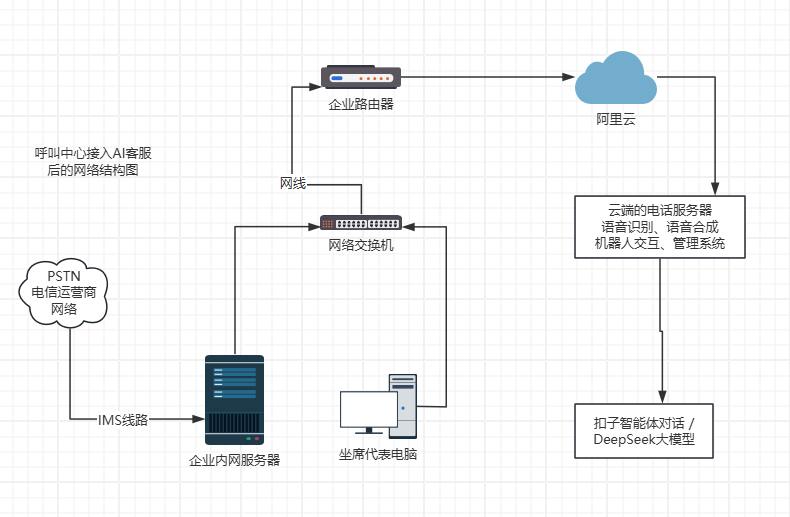

# easycallcenter365

 

基于FreeSWITCH和大模型的智能电话客服系统。

### 功能列表

* 支持对接大模型
* 支持对接 `coze` 智能体
* 支持对接 `maxKB` 开源知识库
* 支持AI客服说话时被打断
* 提供网页管理系统，支持在线配置
* 实时流式语音合成
* 支持acd话务排队
* 支持AI通话无缝转接人工坐席
* 支持电话工具条
* 支持IMS视频通话/语音通话转视频
 
更新日期: 2025/05/05

### 技术交流 && 商业咨询

   bug反馈或者咨询问题请在gitee/github上，新建 Issue，并贴上日志。

   

### 一键安装包

**从源代码编译，请参考后面的编译说明** 。 一键安装体验包的地址在百度网盘。
链接: https://pan.baidu.com/s/1ZnQ64KIJWn1p-iJr-b9f4A 提取码: z2qn 
一键安装包内置了FreeSWITCH-1.10.11、funasr-0.1.9、easycallcenter365.jar、easycallcenter365-gui.jar、mysql-8。
下载到本地后，按照目录中的"使用说明.txt" 导入VmWare虚拟机并启动，最后调整相关参数即可体验测试。
该部署方案可以省去从源代码编译的繁琐步骤，适合用户快速体验产品特性。

### 二进制安装包

我们提供了预编译的二进制文件。 下载地址: https://pan.baidu.com/s/1xFgMPCu0VKHKnG69QhyTlA 提取码: etv5
部署文档参考目录下的文件 "部署文档.txt"。 该部署方案可以省去从源代码编译的繁琐步骤。

### 系统截图



### 呼入电话的处理流程

    
   
* 客户来电时，电话一般进入 public context 的拨号计划，然后在拨号计划中调用 curl 指令，
curl 请求 easycallcenter365 的一个 api 接口，把通话uuid、主叫被叫等信息发送过去。通话被 easycallcenter365 接管。

* `easycallcenter365` 启动录音/录像。`easycallcenter365` 尝试和`机器人大脑`(deepseek/Coze智能体/MaxKB) 建立连接 。
* `机器人大脑` 以流式http响应的返回开场白，easycallcenter365 一边接收文本，一边调用 speak 指令发送文本进行语音合成。
* FreeSWITCH 的 mod_aliyun_tts 收到语音合成指令后，提取参数中的文本，然后连接语音合成服务器，发送语音合成请求。
* 由于整个过程中，文本是不断产生的，mod_aliyun_tts 一边发送语音合成文本，一边接收合成后的语音流数据，同时进行解码语音并播放。
* 播放完毕后，FreeSWITCH 启动语音识别的检测。通过 mod_funasr 或者 unimrcp 模块实现语音流的发送及语音识别结果文本的接收。
* 通过 event socket 消息，FreeSWITCH 把收到的语音识别结果文本，发送给 easycallcenter365。
* easycallcenter365 把语音识别结果文本，附带前面交互的消息，一起打包，发送给  `机器人大脑` 。
* 接下来继续循环，直到电话通话结束。

### 运行环境

   该项目目前仅在 debian-12 环境下编译测试通过。其他操作系统环境尚未测试。 

### 设置Debian12的中文支持

解决乱码问题： vim ~/.profile  追加配置：

```bash
LANG=zh_CN.UTF-8
LANGUAGE=zh_CN.UTF-8    
```	

如果不设置，会导致语音合成异常。让配置立即生效：

```bash
source ~/.profile
```	

### 如何编译`easycallcenter365`

参考  [Build.md](Build.md)

### 编译`easycallcenter365-gui`
 
`easycallcenter365-gui` 是 `easycallcenter365`的可视化管理web界面系统。项目地址及编译参考 [/easycallcenter365/easycallcenter365-gui](https://gitee.com/easycallcenter365/easycallcenter365-gui)

### 编译FreeSWITCH模块
 
这里主要是指 **流式语音合成** 以及 **语音识别** 模块。参考 [/easycallcenter365/freeswitch-modules-libs](https://gitee.com/easycallcenter365/freeswitch-modules-libs)
   
### 详细部署及配置

参考文件 [Deploy.txt](https://github.com/easycallcenter365/easycallcenter365/blob/master/Deploy.txt)。

   
### 目前支持哪些语音识别方式?   

目前支持 websocket、mrcp 语音识别方式。目前 mod_funasr 支持 websocket 方式对接funasr语音识别。 
mrcp 语音识别方式，支持阿里云语音识别， 可以参考阿里云官网关于sdm-mrcp-server配置阿里云asr的文档。  
注意：目前mrcp语音识别方式，无法实现对机器人语音的打断功能。  
  

### 如何设置转接到外部网关  

在AI通话中，如果用户明确表达了转人工的诉求，系统会自动转人工坐席。
登录可视化web管理后台，找到菜单: "呼叫管理" -> "参数设置"。

* 参数 `transfer-to-agent-type` 的值设置为 `gateway`。

* 参数 `transfer-to-agent-gateway-number` 的值设置为转人工的号码，比如 15005600327 或者一个固话号码。

* 参数 `transfer-to-agent-gateway-info` 设置转人工网关的参数。 比如：
```txt
gatewayAddr=192.168.14.252:5090&caller=64901409&profile=external&calleePrefix=
```
这里解释下，`gatewayAddr` 是网关地址及端口，`caller` 是主叫号码，`profile` 是外呼时的路由profile，`calleePrefix` 是被叫前缀。

  
### 如何设置转内置人工坐席

  在AI通话中，如果用户明确表达了转人工的诉求，系统会自动转人工坐席。
  
  登录可视化web管理后台，找到菜单: "呼叫管理" -> "参数设置"。
  
  请把参数 `transfer-to-agent-type` 的值设置为 `acd`。

  转人工坐席的流程是，先自动排队，然后转接给空闲坐席处理，坐席需要通过电话工具条登录。  
  
   
  
  坐席接听测试方法：请用记事本打开 docs\phone-bar.html 文件，
  修改 scriptServer 的地址为 easycallcenter365 所在服务器的IP地址，保存后重新使用浏览器打开 phone-bar.html 文件。
  点击 "签入" 按钮，登录上线。 如果无法登录，请检查 easycallcenter365.jar 是否启动。
  然后点击 "置闲" 按钮，同时注册软电话分机 1018 ， 最后等待电话接入。

### 如何设置电话工具条的分机号及工号

  用记事本打开 docs\phone-bar.html 文件。
  
  找到   
```java     
var scriptServer = "192.168.14.218";		
var  extnum = '1018'; //分机号		
var opnum = '8001'; //工号		
var skillLevel = 9; //技能等级		
var groupId = 1; // 业务组id  
```		
		
  按照提示修改即可。
  
### 传统电话接入后的网络结构图

 
  
### 呼叫中心接入后的网络结构图

 

  
  